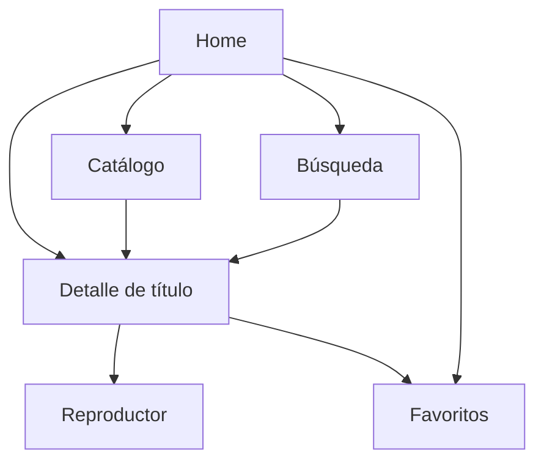

# proyecto-cochatv-upds-

## 1. Descripción del proyecto

CochaTV es una plataforma de streaming que permite explorar un catálogo interactivo de películas, series, comedia, etc. Es de uso gratuito y no requiere licencias de uso.

- **Tipo de app:** frontend, consumiendo una API pública de contenido audiovisual.
- **Tecnologías:** Vue.js y Tailwind CSS.
- **API pública:** [TMDB (The Movie Database)](https://www.themoviedb.org/documentation/api) para obtener catálogo, géneros, detalles e imágenes de películas y series.
- **Referente funcional:** apps de streaming tipo Netflix, Amazon Prime Video, Disney+, etc.

### Integrantes
- Limberth Checo Cusi
- Jonathan Figueroa Peñarieta
- Rodrigo Fernando Morales Perez

## 2. Referencias

Plataformas usadas como referencia de diseño y experiencia de usuario, y los segmentos de cada una en los que nos basaremos:

| Plataforma | URL | Segmentos de referencia |
|---|---|---|
| Netflix | https://www.netflix.com | Home (carruseles por categoría), catálogo, página de detalle de título, reproductor |
| Amazon Prime Video | https://www.primevideo.com | Home, catálogo, página de detalle, reproductor |
| HBO Max | https://www.max.com | Home, catálogo, página de detalle |
| Disney+ | https://www.disneyplus.com | Home, catálogo, página de detalle |
| Crunchyroll | https://www.crunchyroll.com | Home, catálogo, página de detalle |

## 3. Arquitectura

### Propósito
Ofrecer una plataforma de streaming gratuita donde el usuario pueda explorar, buscar y visualizar información de películas, series y contenido de comedia, con una experiencia similar a los servicios de streaming comerciales.

### Usuario objetivo
Personas que buscan descubrir y explorar catálogos de películas y series de forma gratuita, sin necesidad de suscripción ni licencias.

### Secciones del portal
- **Home:** contenido destacado y carruseles por categoría/género.
- **Catálogo:** listado de películas y series con filtros (género, tipo, popularidad).
- **Búsqueda:** búsqueda de títulos por nombre.
- **Detalle de título:** información de la película/serie (sinopsis, reparto, temporadas/episodios, valoración).
- **Reproductor:** vista de reproducción/preview del contenido.
- **Perfil/Favoritos:** lista de contenido guardado por el usuario.

### Mapa de navegación / flujo

### Contenido de cada pantalla
- **Home:** banner principal, carruseles de "Populares", "Tendencias", "Por género", accesos a búsqueda y perfil.
- **Catálogo:** grid de tarjetas de títulos, filtros laterales/superiores, paginación o scroll infinito.
- **Búsqueda:** input de búsqueda, resultados en grid, mensaje de "sin resultados".
- **Detalle de título:** imagen/backdrop, título, sinopsis, género, año, valoración, botón de reproducir, botón de agregar a favoritos.
- **Reproductor:** video/trailer, controles básicos, botón de volver al detalle.
- **Favoritos:** grid de títulos guardados por el usuario.

## 4. Maquetado

## 5. Cierre y evidencias

